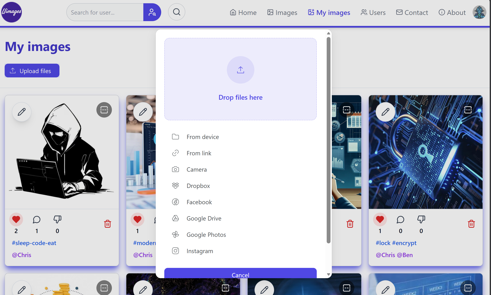
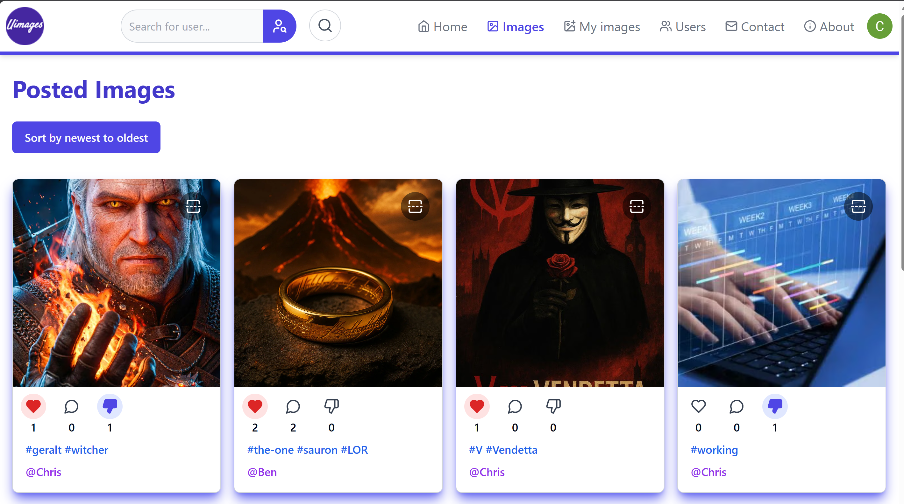
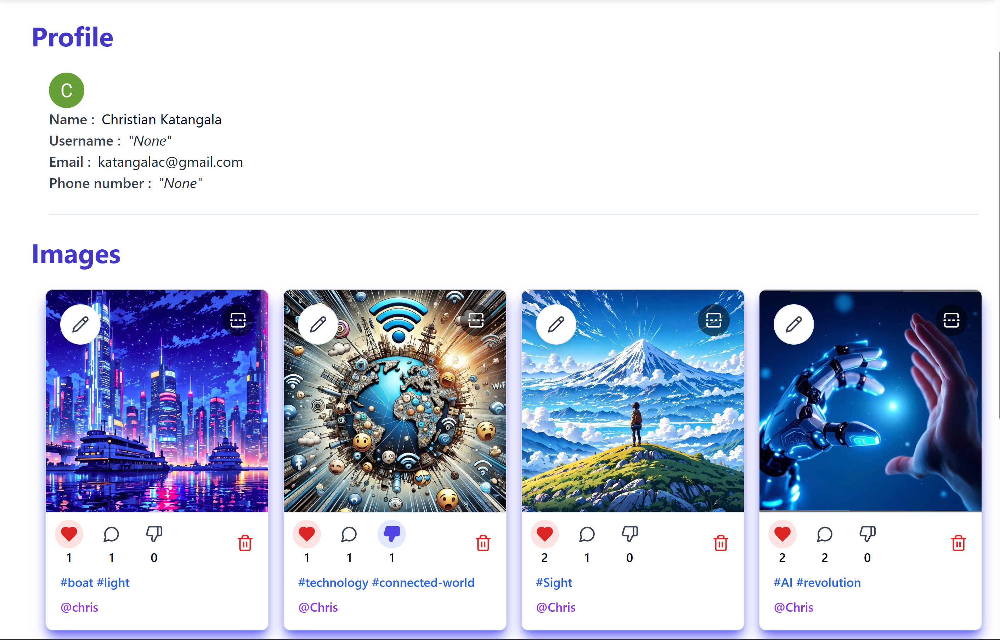
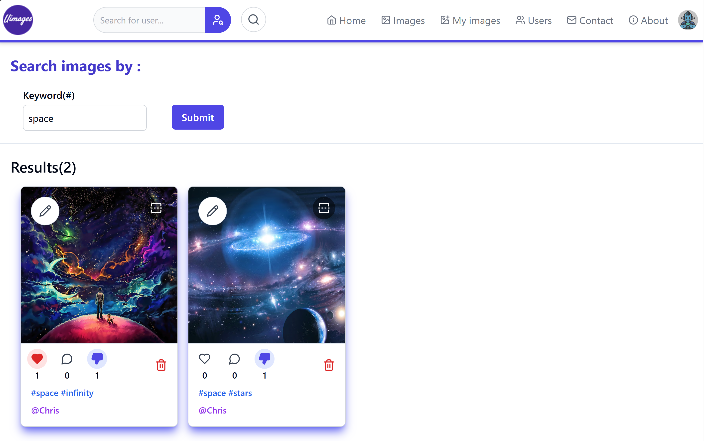
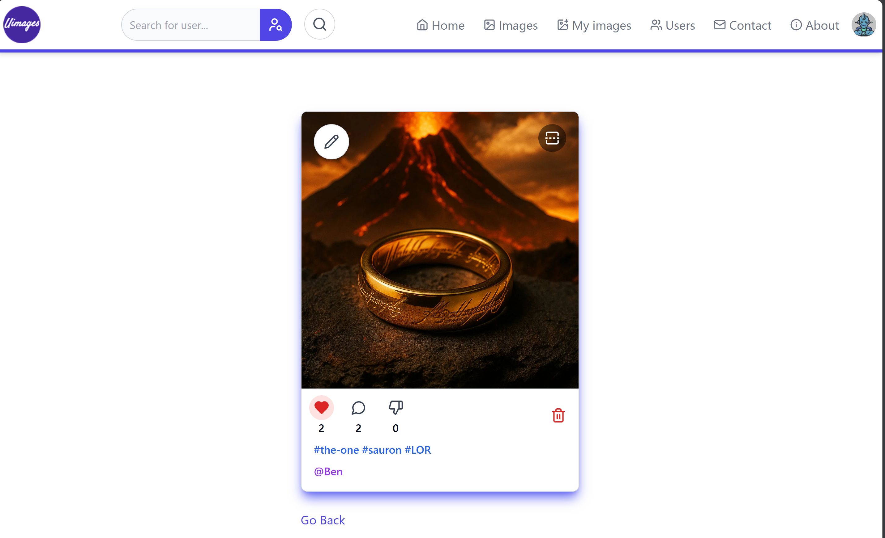
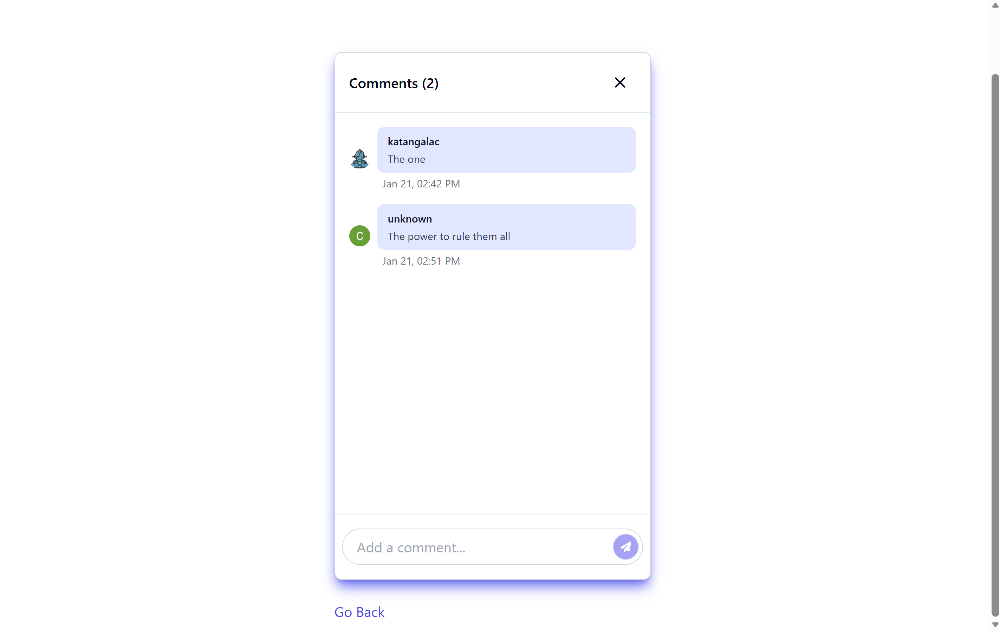
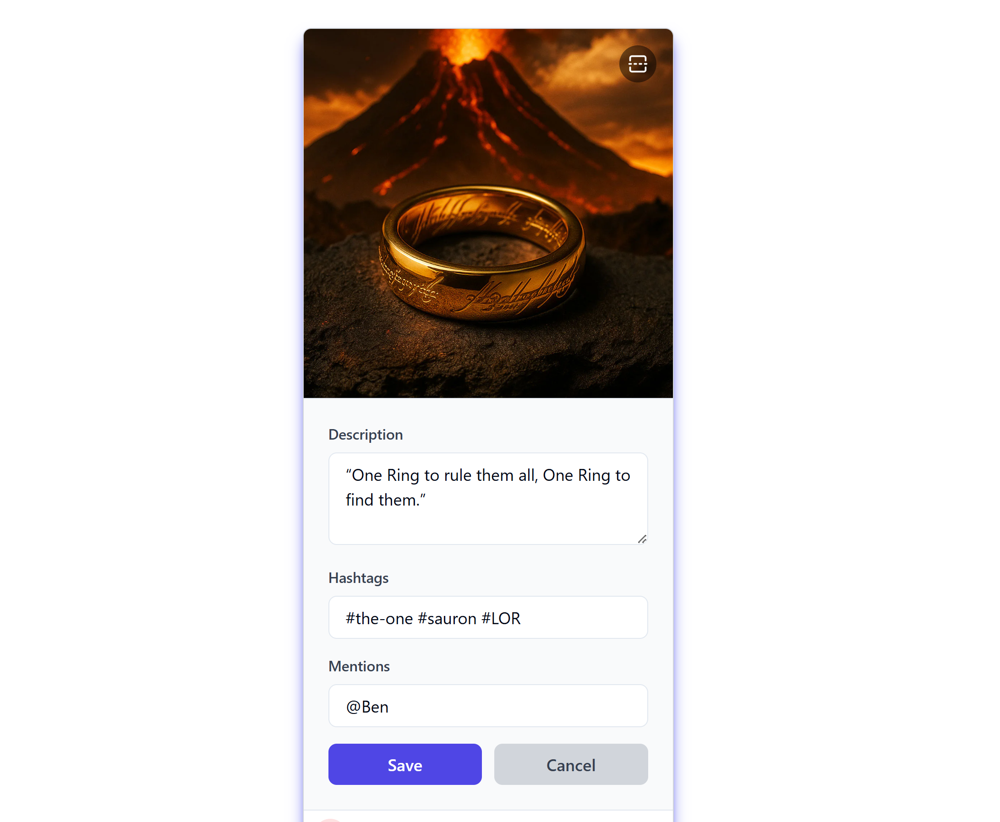
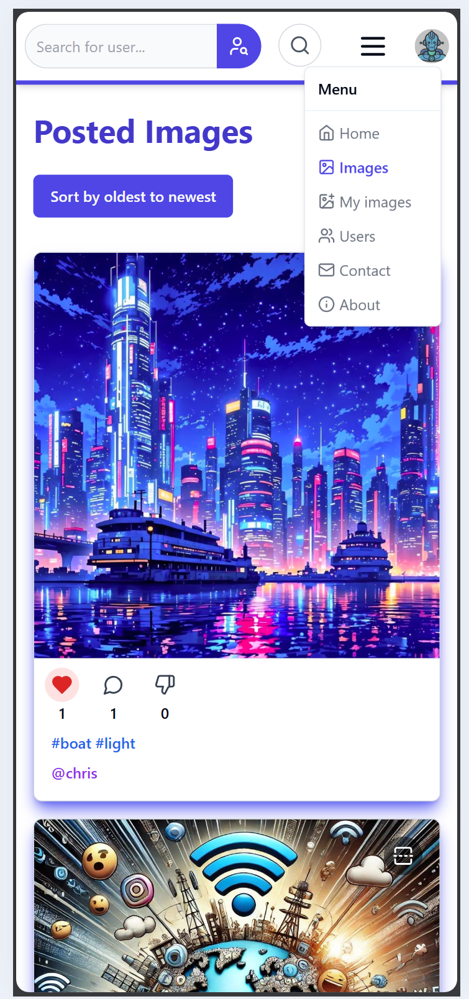

# Image Sharing Application

## Note
This project was originally developed as part of a university course.
The repository history does not reflect the full development process.
This repository is for portfolio purpose only!

## 📸 Image Sharing Platform

A social web platform that allows users to publish images, interact through likes and comments, and manage their profiles.
This project focuses on authentication, performance, and modern web development best practices.

## ✨ Key Features

- Image publishing and management

- Likes and comments

- Secure authentication via OAuth

- User image feed

- Profile management

## 🛠️ Tech Stack

- Frontend: Next.js, React, Typescript, TailwindCSS

- Backend: tRPC

- Database: PostgreSQL, Amazon RDS

- ORM: Prisma

- Authentication: Clerk

- DevOps: Docker, CI/CD

- Monitoring: Sentry, Vercel Analytics

- Deployment: Vercel

## 🧠 Skills & Concepts

- OAuth-based authentication

- Type-safe API with tRPC

- ORM for Database modeling

- Application containerization with Docker

- CI/CD pipeline setup

- Production monitoring and error tracking

- Web performance optimization

## 🖼️ Application Preview

### Landing page

### Main page (Images upload page)

### All images

### User page

### Search images

### Image page

### Image comment section

### Image metadata modification

### Responsiveness

## 🚀 Project Goal

This project allowed me to:

- work with a modern full-stack ecosystem

- understand the challenges of social applications

- implement authentication, deployment, and monitoring workflows